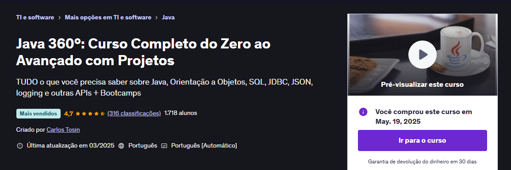

# Curso Java 360 Completo do Zero ao Avançado. 
### Curso introdutório de Java criado pelo professor Carlos Tosin co-fundador da antiga escola Softblue.

Nesse repositório irei fazer os commits do meu aprendizado em Java e Git 